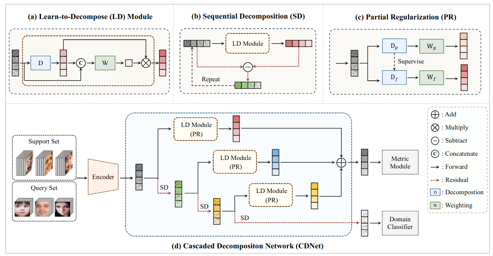

# Learn-to-Decompose: Cascaded Decomposition Network for Cross-Domian Few-Shot Facial Expression Recignition
[[Paper]](https://arxiv.org/abs/2207.07973) [[Code]](https://github.com/zouxinyi0625/CDNet)


This is an official implementation of the following paper:
> **Learn-to-Decompose: Cascaded Decomposition Network for Cross-Domian Few-Shot Facial Expression Recignition**
>
> Xinyi Zou, Yan Yan*, Jing-Hao Xue, Si Chen, and Hanzi Wang
>
> *European Conference on Computer Vision (ECCV), 2022* 


In breif, we have the following contributions:

1. propose CDNet which cascades several shared learn-to-decompose (LD) module via a sequential decomposition
mechanism to obtain the general expression prototypes and their corresponing weights.
2. develop a partial regularization strategy to combine the benefits of both
episodic training and batch training
3. achieve stat-of-the-art performance on various compound FER datasets under CD-FSL setting.

Please cite our paper if you find the code useful for your research.

```
@article{zou2022learn,
  title={Learn-to-Decompose: Cascaded Decomposition Network for Cross-Domain Few-Shot Facial Expression Recognition},
  author={Zou, Xinyi and Yan, Yan and Xue, Jing-Hao and Chen, Si and Wang, Hanzi},
  journal={arXiv preprint arXiv:2207.07973},
  year={2022}
}
```


## Usage

### Prerequisites
- Python >= 3.7
- Pytorch >= 1.7 and torchvision (https://pytorch.org/)
- You can use the `requirements.txt` file we provide to setup the environment via Anaconda.
```
conda create --name py37 python=3.7
conda install pytorch torchvision -c pytorch
pip3 install -r requirements.txt
```

### Install
Clone this repository:
```
git clone https://github.com/zouxinyi0625/CDNet.git
cd CDNet
```

### Datasets
- Basic Expression Datasets
  - [MMI Facial Expression Database](https://www.mmifacedb.eu/)
  - [Cohn-Kanade Expression Database](http://www.pitt.edu/~emotion/ck-spread.htm)
  - [Oulu-CASIA NIR&VIS facial expression database](http://www.cse.oulu.fi/CMV/Downloads/Oulu-CASIA)
  - [Real-world Affective Faces (RAF) Database](http://www.whdeng.cn/RAF/model1.html)
  - [(Static Facial Expressions in the Wild](https://cs.anu.edu.au/few/AFEW.html)

- Compound Expression Datasets
  - [Compound Facial Expressions of Emotion](cbcsl.ece.ohio-state.edu/compound.html)
  - [EmotioNet Database](http://cbcsl.ece.ohio-state.edu/dbform_emotionet.html)
  - [Real-world Affective Faces (RAF) Database](http://www.whdeng.cn/RAF/model1.html)


- Download the above FER datasets, and generate the json file with the instruction [here](https://github.com/wyharveychen/CloserLookFewShot#self-defined-setting).
  - Our model is trained on the multiple basic expression datasets, and tested on various compound FER datasets (only the compound subsets).
  - All the images in the basic expression datasets are used for training, and all the images in the compound expression datastes are used for testing.


### Training & Testing
We adopt the pretrained ResNet18 from [here](https://github.com/kaiwang960112/Self-Cure-Network).
- Pretrain (Batch Training)
```
cd batch
python pretrain_e.py --dataset multi --name cascade_e --testset CFEE --split val --color 3 --w_domain 1.0
```
- Finetune (Episodic Training)
```
cd episodic
python train_l2d_pre.py --dataset multi --testset CFEE --split val --train_aug --weight net --name cascade_pre --w_d 1.0 --w_t 1.0 --pretrain
```

## Note
- This code is built upon the implementation from [CloserLookFewShot](https://github.com/wyharveychen/CloserLookFewShot), [CrossDomainFewShot](https://github.com/hytseng0509/CrossDomainFewShot), [AssociateAlignment](https://github.com/ArmanAfrasiyabi/associative-alignment-fs). We greatly thank for the authors for their contributions.
- The dataset, model, and code are for non-commercial research purposes only.
